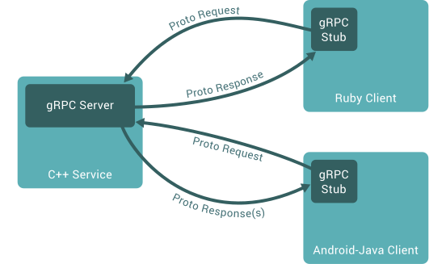

## gRPC
> general-purpose Remote Procedure Calls

google 에서 만든 오픈소스로, 원격지의 프로시저를 호출하는 프레임워크 입니다.
 
gRPC 는 다음과 같은 특징을 갖습니다.

* 원격지 프로시저를 수행하는 규칙 및 파라미터 전달을 위한 인터페이스로 protocol buffer 라는 오픈소스를 활용하고 있습니다.
* Blocking & Non-Blocking 을 지원합니다.
* HTTP/2 프로토콜을 사용합니다.
* 인증, 로드벨런싱, 트레이싱, 헬스체크 등을 제공합니다.
* 10개 언어에서 지원되는 라이브러리가 있습니다.

## gRPC 사용 및 흐름
1. 실행하고자 하는 프로시저와, 전달하고자 하는 파라미터 사양을 .proto 파일로 작성합니다.
2. protoc 를 통해 사용하고자 하는 언어에 맞게 stub 파일을 생성합니다.  
생성된 파일은 각 클라이언트가 참조할 수 있는 언어(.java .c .go 등..) 로써 bean 과 같이 데이터를 엑세스 하거나 핸들링하는 함수가 포함되어 있습니다.
3. gRPC 에서 각 언어별로 제공하는 SDK 를 제공합니다. 이를 활용해 서버, 클라이언트를 프로그래밍 합니다.  
stub 을 활용해 실행될 프로시저를 구현하거나 전달할 파라미터를 생산할수 있습니다.

## .proto 와 stub 파일
protocol buffer 를 사용하는 이점중 하나는 .proto 파일로 구조화된 데이터를 작성하기만 한다면 gRPC가 지원하는 어떤 언어에서든 규약에 상관없이 통신이 가능하다는 것입니다.
작성된 .proto 로부터 언어에 맞는 stub 를 생산하여 참조하게 되면 이후 별도의 사양서를 볼 필요없이 참조한 stub 만으로도 개발이 가능합니다.

## gRPC plugin
gRPC 용으로 좀더 활용 가치가 있는 stub 을 만들기위해서는 protoc 에 grpc plugin 바이너리를 전달해야 합니다. 각 언어마다 plugin 이 존재하므로 해당 플러그인을 직접 구해서 stub 을 만들면 됩니다.
1. protoc 설치
   * go install google.golang.org/protobuf/cmd/protoc-gen-go@latest
   * go install google.golang.org/grpc/cmd/protoc-gen-go-grpc@latest
2. stub(pb.go) 생성
   * protoc --go_out=. --go_opt=paths=source_relative --go-grpc_out=. --go-grpc_opt=paths=source_relative config/config.proto
